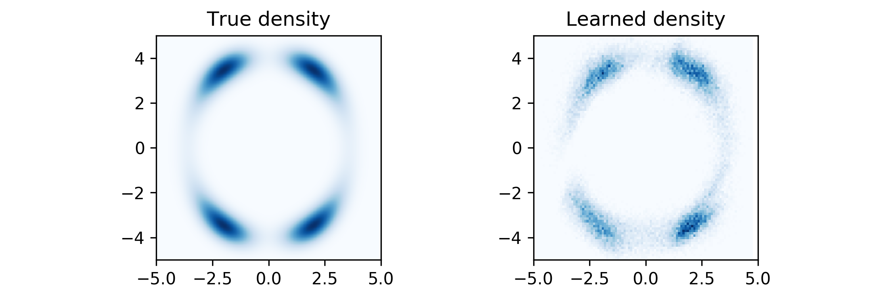

## Planar Flow

This repo contains a Pytorch implementation of Planar Flow presented in (Rezende and Mohamed, 2015) with experiments on a 2D density and MNIST dataset.

### 2D Density Results

### MNIST Results

Input | Model | Latent Space Size | Test Lower Bound |
:--------:|:-----------------|:---:|:------:
[0,1]     |    VAE           |  20 | -99.37 
[0,1]     |    VAE+PF (K=20) |  20 | -98.23
{0,1}     |    VAE           |  20 | -84.60
{0,1}     |    VAE+PF (K=20) |  20 | -81.83

[0,1] denotes float values between 0 and 1 and {0,1} denotes binary values.

#### Usage

Vanilla VAE: `python vae.py`    
VAE with Planar Flow: `python vae-pf.py`

Add `--binary` option to binarize the input dataset.

### References
(Rezende and Mohamed, 2015) Rezende, Danilo, and Shakir Mohamed. "Variational Inference with Normalizing Flows." International Conference on Machine Learning. 2015.
